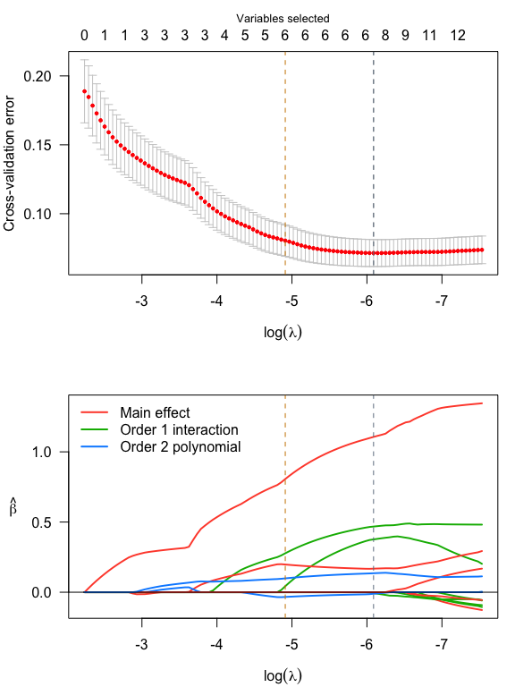
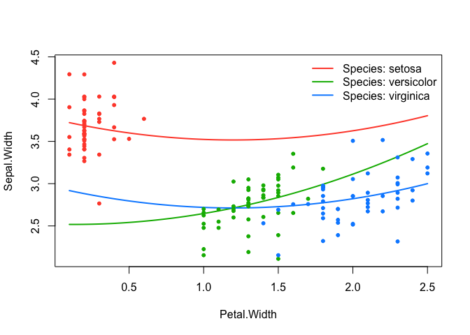

<!-- README.md is generated from README.Rmd. Please edit that file -->

# `sparseR`: Sift smartly through interactions & polynomials with ranked sparsity

[](https://app.codecov.io/gh/petersonR/sparseR)
[](https://github.com/petersonR/sparseR/actions/workflows/R-CMD-check.yaml)
[](https://CRAN.R-project.org/package=sparseR)

## What is ranked sparsity?

The ranked sparsity methods such as the sparsity-ranked lasso (SRL) have
been developed for model selection and estimation in the presence of
interactions and polynomials (Peterson & Cavanaugh
2022)\[<https://doi.org/10.1007/s10182-021-00431-7>\]. The main idea is
that an algorithm should be more skeptical of higher-order polynomials
and interactions a priori compared to main effects, by a predetermined
amount.

## Package overview

The `sparseR` package has many features designed to streamline sifting
through the high-dimensional space of interaction terms and polynomials,
including functions for variable pre-processing, variable selection,
post-selection inference, and post-fit model visualization under ranked
sparsity. The package implements ranked-sparsity-based versions of the
lasso, elastic net, MCP, and SCAD. We also provide a (preliminary)
version of an sparsity-ranked extension to Bayesian Information
Criterion (and corresponding stepwise approaches).

## Installation

``` r

## Via GitHub: 
# install.packages("devtools")
devtools::install_github("petersonR/sparseR")

# or via CRAN
install.packages("sparseR")
```

## Example

``` r
library(sparseR)
```

``` r
data(iris)
srl <- sparseR(Sepal.Width ~ ., data = iris, k = 1, poly = 2, seed = 1)
srl
#> 
#> Model summary @ min CV:
#> -----------------------------------------------------
#>   lasso-penalized linear regression with n=150, p=21
#>   (At lambda=0.0023):
#>     Nonzero coefficients: 7
#>     Cross-validation error (deviance): 0.07
#>     R-squared: 0.62
#>     Signal-to-noise ratio: 1.64
#>     Scale estimate (sigma): 0.267
#> 
#>   SR information:
#>              Vartype Total Selected Saturation Penalty
#>          Main effect     6        2      0.333    2.45
#>  Order 1 interaction    12        3      0.250    3.46
#>   Order 2 polynomial     3        2      0.667    3.00
#> 
#> 
#> Model summary @ CV1se:
#> -----------------------------------------------------
#>   lasso-penalized linear regression with n=150, p=21
#>   (At lambda=0.0074):
#>     Nonzero coefficients: 6
#>     Cross-validation error (deviance): 0.08
#>     R-squared: 0.57
#>     Signal-to-noise ratio: 1.35
#>     Scale estimate (sigma): 0.284
#> 
#>   SR information:
#>              Vartype Total Selected Saturation Penalty
#>          Main effect     6        2      0.333    2.45
#>  Order 1 interaction    12        2      0.167    3.46
#>   Order 2 polynomial     3        2      0.667    3.00
```

``` r

par(mfrow = c(2,1), mar = c(4, 4, 3, 1))
plot(srl, plot_type = "both")
```

<!-- -->

``` r

summary(srl, at = "cv1se")
#> lasso-penalized linear regression with n=150, p=21
#> At lambda=0.0074:
#> -------------------------------------------------
#>   Nonzero coefficients         :   6
#>   Expected nonzero coefficients:   1.10
#>   Average mfdr (6 features)    :   0.183
#> 
#>                                Estimate      z       mfdr Selected
#> Species_setosa                  0.80638 18.013    < 1e-04        *
#> Sepal.Length_poly_1             0.19734  9.713    < 1e-04        *
#> Petal.Width_poly_2              0.09871  4.614 0.00024977        *
#> Petal.Width:Species_versicolor  0.27739  3.259 0.04655092        *
#> Sepal.Length_poly_2            -0.03363 -2.804 0.21141507        *
#> Sepal.Length:Species_setosa     0.04275  2.190 0.84164385        *
```

``` r
effect_plot(srl, "Petal.Width", by = "Species", at = "cv1se", legend_location = "topright")
```

<!-- -->

For more examples and a closer look at how to use this package, check
out the [package website](https://petersonr.github.io/sparseR/).

Many thanks to the authors and maintainers of
[`ncvreg`](https://github.com/pbreheny/ncvreg) and
[`recipes`](https://recipes.tidymodels.org/).
